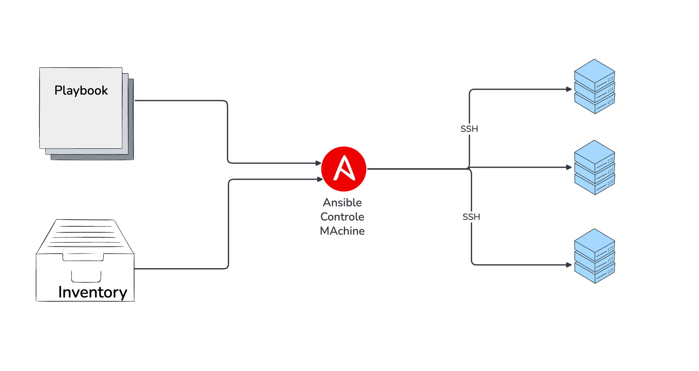
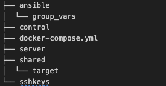
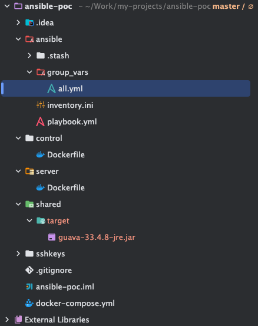

Automation is no longer optional, it’s a must-have. Tools like Ansible
help remove manual repetitive tasks by providing a declarative and
YAML-based automation framework.

In this article we will cover:

1.  What is Ansible?

2.  Why do we use it?

3.  A POC Demo

# What is Ansible?

Ansible is a suite of software tools that enables you to perform
infrastructure as code. It enables you to do software provisioning,
configuration management, and application deployment.

It is an open source and free to use developed by RedHat, Ansible is
written in Python.

It is a software installed into a linux host, Then you can define within
Ansible:

1.  A playbook: Things you want to automate like to install a software
    backage on 10 servers.

2.  Inventory: Is the list of devices that you want to automate (a Set
    of hosts that you want Ansible to work against).

3.  Ansible: Ansible software package where you run the playbook and
    configure devices.

<figure>

<figcaption aria-hidden="true">What is Ansible?</figcaption>
</figure>

Ansible Key Characteristics:

1.  Agentless → No need to install clients on servers.

2.  Declarative → Describe the desired state in YAML, Ansible makes it
    happen.

3.  Extensible → Supports modules for cloud, containers, security, and
    CI/CD.

4.  Idempotent → Running the same playbook twice won’t break your
    system.

5.  Community Driven → That means that these things that we want to do
    in the playbook, chances are someone out there has already developed
    the playbooks, the modules, The tasks that we need to actually do
    those operations. Those are basically published as a collection in
    what’s called [Ansible Galaxy](https://galaxy.ansible.com/), Which
    is a repository where developers can kind of contribute their
    Ansible whatever they have created in the ecosystem.

# Why do we use it?

1.  Simplicity → YAML playbooks are human-readable.

2.  Scalability → Manage 1 server or 10,000 servers with the same
    playbook.

3.  Integration → Works with cloud, CI/CD pipelines, and DevOps
    ecosystems.

# POC Demo

We’ll use a containerized Ansible environment as follows:

1.  Ansible Control Node (container) → runs playbooks.

2.  Server 1 (staging) → Ansible will SSH into it, then use curl to
    download a file.

3.  Server 2 (target) → Ansible will SSH into it and copy the file from
    Server 1.

4.  Shared Folder → mounted on Server 2 to verify that the file reached
    its destination.

- Step 1: Project folder Structure:

  <figure>
  
  </figure>

- Step 2: Generate an SSH key :

  Ansible connects to remote machines over SSH. By default, SSH asks for
  a password, That’s where key-based authentication comes in. These Keys
  let Ansible connect securely to the containers.

      # 1) Generate an SSH keypair for Ansible control
      ssh-keygen -t rsa -b 4096 -N "" -f ./sshkeys/id_rsa

      # 2) Copy the SSH Key to ./sshkeys/authorized_keys under the project
      cp ./sshkeys/id_rsa.pub ./sshkeys/authorized_keys

- Step 3: Create the Dockerfiles

  1.  control/Dockerfile → install Ansible & SSH client.

          FROM python:3.12-slim

          RUN apt-get update && apt-get install -y --no-install-recommends \
              openssh-client sshpass curl ca-certificates git jq \
           && rm -rf /var/lib/apt/lists/*

          # Install Ansible
          RUN pip install ansible

          RUN useradd -ms /bin/bash ansible && mkdir -p /home/ansible/.ssh && chown -R ansible:ansible /home/ansible

          USER ansible
          WORKDIR /workspace

          # To make container UP
          CMD ["sleep", "infinity"]

      As You see, we install openssh-client,ansible using pip, and we
      explicitly add a non-root user named "ansible", We have created a
      dedicated user to limit privileges, and we grant only what’s
      needed (e.g., passwordless sudo for certain tasks).

  2.  server/Dockerfile → installs SSH server, curl, and Python.

          FROM debian:stable-slim

          RUN apt-get update && apt-get install -y --no-install-recommends \
              openssh-server curl ca-certificates sudo python3 \
           && rm -rf /var/lib/apt/lists/*

          # Create ansible user with passwordless sudo
          RUN useradd -ms /bin/bash ansible && echo "ansible ALL=(ALL) NOPASSWD:ALL" > /etc/sudoers.d/ansible && chmod 440 /etc/sudoers.d/ansible

          # SSH setup
          RUN mkdir -p /var/run/sshd /home/ansible/.ssh /data/staging /data/target \
           && chown -R ansible:ansible /home/ansible /data

          EXPOSE 22
          CMD ["/usr/sbin/sshd", "-D"]

      We have installed the required Packages:

• openssh-server → So the container can accept SSH connections. • curl →
Used by Ansible playbook to download artifacts. • ca-certificates →
Ensures HTTPS downloads work (SSL trust). • sudo → Lets the ansible user
elevate privileges when needed. • python3 → Required by Ansible modules
on the remote host.

\+ Then we prepare the SSH and Folder Directory :

• /var/run/sshd → Required runtime folder for the SSH daemon. •
/home/ansible/.ssh → Stores authorized keys for login. • /data/staging
and /data/target → Simulated file system locations for downloaded and
transferred files. • Ownership is set to ansible:ansible for correct
permissions.

- Step 4: Create docker-compose.yml

  Defines three services, They all share the same Docker network:

  1.  ansible-control (Ansible container)

  2.  server1 (staging)

  3.  server2 (target)

  <!-- -->

      version: "3.9"

      services:
        ansible-control:
          build:
            context: ./control
          container_name: ansible-control
          working_dir: /workspace
          volumes:
            - ./ansible:/workspace
            - ./sshkeys:/home/ansible/.ssh:rw   # bind mount host keys
          networks:
            - ansible_net
          depends_on:
            - server1
            - server2

        server1:
          build:
            context: ./server
          container_name: server1
          hostname: server1
          networks:
            - ansible_net
          ports:
            - "2221:22"
          volumes:
            - ./sshkeys/authorized_keys:/home/ansible/.ssh/authorized_keys:ro
          environment:
            - TZ=UTC

        server2:
          build:
            context: ./server
          container_name: server2
          hostname: server2
          networks:
            - ansible_net
          ports:
            - "2222:22"
          volumes:
            - ./sshkeys/authorized_keys:/home/ansible/.ssh/authorized_keys:ro
            - ./shared/target:/data/target
          environment:
            - TZ=UTC

      networks:
        ansible_net:

- Step 5: Create Ansible Inventory

  File: ansible/inventory.ini This file tells Ansible which hosts to
  connect to and how to connect.

      [staging]
      server1 ansible_host=server1 ansible_user=ansible ansible_ssh_private_key_file=/home/ansible/.ssh/id_rsa

      [target]
      server2 ansible_host=server2 ansible_user=ansible ansible_ssh_private_key_file=/home/ansible/.ssh/id_rsa

      [all:vars]
      ansible_ssh_common_args='-o StrictHostKeyChecking=no'

  - \[staging\] • Defines the staging group. • Contains one host →
    server1. • ansible\_host=server1 → uses the container’s hostname on
    the Docker network.

  - \[target\] • Defines the target group. • Contains one host →
    server2. • This is where the final file ends up.

  - Connection Details • ansible\_user=ansible → login as the ansible
    user (not root). •
    ansible\_ssh\_private\_key\_file=/home/ansible/.ssh/id\_rsa Path
    inside the control node container where the private key is mounted.
    Matches the public key we placed in each server’s authorized\_keys.

  - \[all:vars\] • Applies to all hosts. • Disables strict host key
    checking → avoids prompt during SSH.

- Step 6: Create a Variables File

  File: ansible/group\_vars/all.yml

      # Artifact to download on server1
      artifact_group: "com/google/guava"
      artifact_version: "33.4.8-jre"
      artifact_name: "guava-{{ artifact_version }}.jar"
      artifact_base: "https://repo1.maven.org/maven2/{{ artifact_group }}/guava/{{ artifact_version }}"
      artifact_url: "{{ artifact_base }}/{{ artifact_name }}"

      # Paths on the servers
      staging_dir: "/data/staging"
      target_dir: "/data/target"

      # Temporary path on control node for relay
      control_stash: "/workspace/.stash"

- Step 7: Create the Playbook

  File: ansible/playbook.yml

      ---
      - name: Stage 1 — Download to server1 over SSH
        hosts: staging
        gather_facts: false
        vars_files:
          - group_vars/all.yml

        pre_tasks:
          - name: Ensure staging_dir exists
            file:
              path: "{{ staging_dir }}"
              state: directory
              mode: "0755"
            become: true

        tasks:

          - name: Try to fetch .sha1
            uri:
              url: "{{ artifact_url }}.sha1"
              return_content: true
              status_code: [200, 404]
            register: sha1_try

          - name: Decide checksum algorithm and value
            set_fact:
              checksum_alg: >-
                {{
                   'sha1'   if (sha1_try is defined and sha1_try.status == 200) else
                   '' }}
              checksum_val_raw: >-
                {{
                     sha1_try.content   if (sha1_try is defined and sha1_try.status   == 200) else ''  | default('') }}

          - name: Normalize checksum (strip filename/whitespace)
            set_fact:
              checksum_val: "{{ checksum_val_raw | regex_replace('\\s.*$', '') | trim }}"

          - name: Show which checksum will be used
            debug:
              msg: >-
                Using checksum {{ checksum_alg }}:{{ checksum_val if checksum_alg else '(none available; downloading without validation)'}}

          - name: Download artifact with checksum if available
            get_url:
              url: "{{ artifact_url }}"
              dest: "{{ staging_dir }}/{{ artifact_name }}"
              mode: "0644"
              checksum: "{{ (checksum_alg ~ ':' ~ checksum_val) if checksum_alg else omit }}"
            register: dl

      - name: Stage 2 — Fetch from server1 to control node
        hosts: staging
        gather_facts: false
        vars_files:
          - group_vars/all.yml

        pre_tasks:
          - name: Ensure control stash exists (on control node)
            delegate_to: localhost
            file:
              path: "{{ control_stash }}"
              state: directory
              mode: "0755"

        tasks:
          - name: Fetch the file to control node
            fetch:
              src: "{{ staging_dir }}/{{ artifact_name }}"
              dest: "{{ control_stash }}/"
              flat: true

      - name: Stage 3 — Push from control node to server2
        hosts: target
        gather_facts: false
        vars_files:
          - group_vars/all.yml

        pre_tasks:
          - name: Ensure target_dir exists
            file:
              path: "{{ target_dir }}"
              state: directory
              mode: "0755"
            become: true

        tasks:
          - name: Copy artifact from control to server2
            copy:
              src: "{{ control_stash }}/{{ artifact_name }}"
              dest: "{{ target_dir }}/{{ artifact_name }}"
              mode: "0644"

          - name: Verify on server2
            stat:
              path: "{{ target_dir }}/{{ artifact_name }}"
            register: tgt

          - name: Show final location
            debug:
              msg:
                - "Transfer complete."
                - "server2 path: {{ target_dir }}/{{ artifact_name }}"
                - "On your PC: ./shared/target/{{ artifact_name }}"

This playbook has three stages: 1. Stage 1 (staging server) → SSH into
server1, download an artifact (with checksum validation). 2. Stage 2
(fetch) → Pull the file back from server1 to the Ansible control node.
3. Stage 3 (target server) → Copy the file from control to server2 and
verify it arrived.

- Step 8: Build and Start Containers

      docker compose up -d --build

- Step 9: Verify SSH Connectivity

      docker exec -it ansible-control bash -lc "ssh ansible@server1 'echo OK from server1'"

  Output:

      OK from server1

- Step 10: Run the Playbook

  Run the playbook from your Local machine:

      docker exec -it ansible-control bash -lc "ansible-playbook -i inventory.ini playbook.yml"

  Output :

      docker exec -it ansible-control bash -lc 'ansible-playbook -i inventory.ini playbook.yml'

      PLAY [Stage 1 — Download to server1 over SSH] ******************************************************************************************************************************************

      TASK [Ensure staging_dir exists] *******************************************************************************************************************************************************
      [WARNING]: Platform linux on host server1 is using the discovered Python interpreter at /usr/bin/python3.13, but future installation of another Python interpreter could change the
      meaning of that path. See https://docs.ansible.com/ansible-core/2.18/reference_appendices/interpreter_discovery.html for more information.
      ok: [server1]

      TASK [Try to fetch .sha1] **************************************************************************************************************************************************************
      ok: [server1]

      TASK [Decide checksum algorithm and value] *********************************************************************************************************************************************
      ok: [server1]

      TASK [Normalize checksum (strip filename/whitespace)] **********************************************************************************************************************************
      ok: [server1]

      TASK [Show which checksum will be used] ************************************************************************************************************************************************
      ok: [server1] => {
          "msg": "Using checksum sha1:e70a3268e6cd3e7d458aa15787ce6811c34e96ae"
      }

      TASK [Download artifact with checksum if available] ************************************************************************************************************************************
      ok: [server1]

      PLAY [Stage 2 — Fetch from server1 to control node] ************************************************************************************************************************************

      TASK [Ensure control stash exists (on control node)] ***********************************************************************************************************************************
      changed: [server1 -> localhost]

      TASK [Fetch the file to control node] **************************************************************************************************************************************************
      changed: [server1]

      PLAY [Stage 3 — Push from control node to server2] *************************************************************************************************************************************

      TASK [Ensure target_dir exists] ********************************************************************************************************************************************************
      [WARNING]: Platform linux on host server2 is using the discovered Python interpreter at /usr/bin/python3.13, but future installation of another Python interpreter could change the
      meaning of that path. See https://docs.ansible.com/ansible-core/2.18/reference_appendices/interpreter_discovery.html for more information.
      ok: [server2]

      TASK [Copy artifact from control to server2] *******************************************************************************************************************************************
      changed: [server2]

      TASK [Verify on server2] ***************************************************************************************************************************************************************
      ok: [server2]

      TASK [Show final location] *************************************************************************************************************************************************************
      ok: [server2] => {
          "msg": [
              "Transfer complete.",
              "server2 path: /data/target/guava-33.4.8-jre.jar",
              "On your Mac: ./shared/target/guava-33.4.8-jre.jar"
          ]
      }

      PLAY RECAP *****************************************************************************************************************************************************************************
      server1                    : ok=8    changed=2    unreachable=0    failed=0    skipped=0    rescued=0    ignored=0
      server2                    : ok=4    changed=1    unreachable=0    failed=0    skipped=0    rescued=0    ignored=0

- Step 11: Confirm the Result

  In the Project directory check the directory shared/target, we will
  see the "guava-33.4.8-jre.jar" file.

\+ 

# Summary :

- We successfully built a multi-container Ansible lab.

- Verified SSH automation across servers.

- Simulated a file pipeline (download → fetch → copy).

Resources:

1.  [Ansible for Beginners to Advanced | DevOps
    Bootcamp](https://www.youtube.com/watch?v=lhFvMsy6VX8&list=PLy7NrYWoggjwwEpZO8sscD9X6EH39njz6)

2.  [What is
    Ansible?](https://www.youtube.com/watch?app=desktop&v=fHO1X93e4WA&t=382s)

3.  [Ansible UI](https://www.youtube.com/watch?v=NyOSoLn5T5U)
